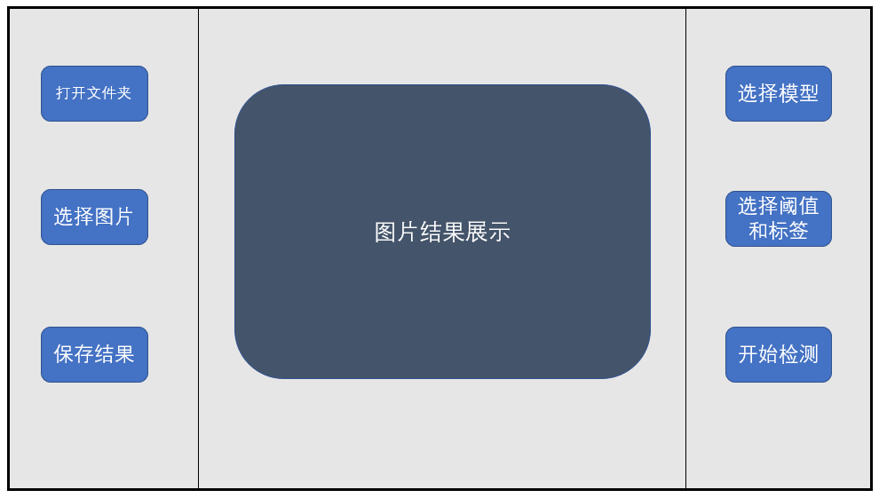
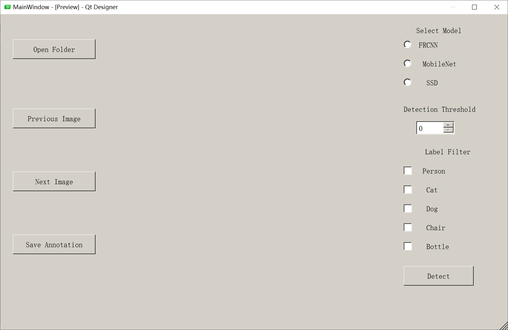

## 综合实验

### 任务

用深度学习模型，完成目标检测:sunglasses:

### 需要实现的功能

+ [x] 设计界面

- [ ] 打开文件夹，导入此文件夹中的所有图片

+ [ ] 可以在软件中选取需要进行检测的图片
+ [ ] 可以选用不同的模型检测
+ [ ] 训练得到不同的模型
+ [ ] 可以自定义阈值，即在这个阈值之上的结果才作为模型的预测结果并显示到界面中
+ [ ] 可以自定义标签，表明想要让模型检测哪些类别的物体
+ [ ] 检测与结果的导出

### 界面的布局

### 开发工具

+ python
+ tensorflow

### 配置管理工具

+ git

### 工作进度

见`doc/log.md`